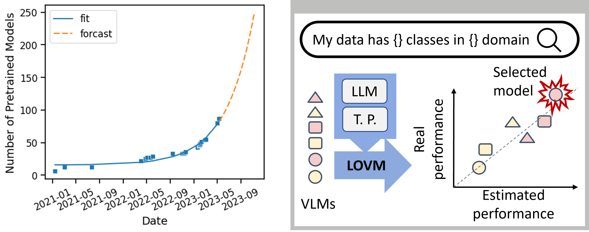
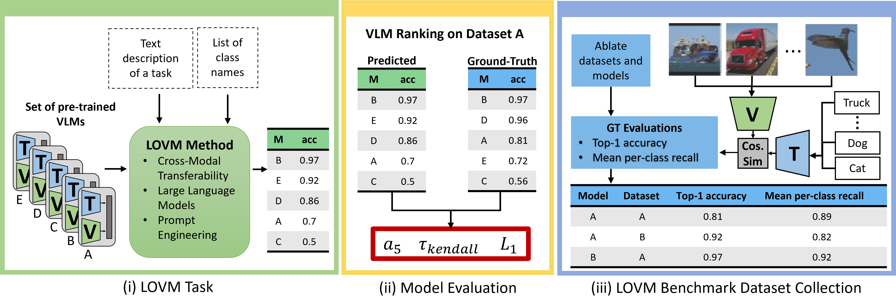

# LOVM - Language-Only Vision Model Selection
[`Paper`](https://arxiv.org/abs/2306.08893) [`Website`](https://orrzohar.github.io/projects/lovm/) 

#### [Orr Zohar](https://orrzohar.github.io/), [Mars Huang](https://marshuang80.github.io/), [Jackson Wang](https://wangkua1.github.io/), [Serena Yeung](https://marvl.stanford.edu/people.html)

## Abstract

Pre-trained multi-modal vision-language models (VLMs) are becoming increasingly popular due to their exceptional performance on downstream vision applications, particularly in the few- and zero-shot settings. 
However, selecting the best-performing VLM for some downstream applications is non-trivial, as it is dataset and task-dependent. Meanwhile, the exhaustive evaluation of all available VLMs on a novel application is not only time and  computationally demanding but also necessitates the collection of a labeled dataset for evaluation. 
As the number of open-source VLM variants increases, there is a need for an efficient model selection strategy that does not require access to a curated evaluation dataset. 
This paper proposes a novel task and benchmark for efficiently evaluating VLMs' zero-shot performance on downstream applications without access to the downstream task dataset. 
Specifically, we introduce a new task LOVM: **L**anguage-**O**nly  **V**ision  **M**odel Selection, where methods are expected to perform both model selection and performance prediction based solely on a text description of the desired downstream application.
We then introduced an extensive LOVM benchmark consisting of ground-truth evaluations of 35 pre-trained VLMs and 23 datasets, where methods are expected to rank the pre-trained VLMs and predict their zero-shot performance. 

<br>


<p align="center">LOVM Motivation and application. With the number of pre-trained VLMs growing exponentially, evaluation-free methods for model selection can improve the accessibility of downstream applications.
</p>

## 


## LOVM Task
The Language-Only Vision-Language Model (LOVM) selection task represents a novel approach to model selection in the field of pre-trained vision-language models (VLMs). It aims to efficiently select the most suitable VLM and predict its performance based solely on a text description of a downstream vision task, eliminating the need for access to the downstream task dataset. This is particularly useful for users who lack the resources or technical proficiency to collect and label an evaluation dataset and subsequently evaluate all available VLMs. LOVM methods leverage the phenomenon of cross-modality transferability, using text as a proxy for corresponding images. The ultimate goal of LOVM is to simplify and democratize the model selection process, allowing users with minimal technical expertise to deploy effective AI solutions for their specific vision tasks.


<p align="center">LOVM Task. (i) A LOVM method is expected, given a text description of the task and a list of class names, to rank and predict the performance of a set of pre-trained VLMS.
(ii) We evaluate methods by comparing the performance to the ground-truth image-based evaluations (iii) we collect and report.  
</p>


## Benchmark Details
The LOVM dir contains all the dataset files, which include:
1. eval_table.csv -  a file containing all the ground-truth image-based evaluations. 
2. dataset_tasks.json - a per-dataset description of the task.
3. dataset_domains.json - a per-dataset description of the task domain.
4. datasets.txt - a list of the datasets
5. models.yml - a list of the open_clip models used
6. classnames .txt files - a text file for each dataset containing the list of class names
7. templates .txt files- a text file for each dataset containing the list of templates
8. constants.py - a file containing the constants, including the number of models to use when calculating the list ranking metrics. 

```
LOVM/
└── LOVM/
    ├── eval_table.csv
    ├── dataset_tasks.json
    ├── dataset_domains.json
    ├── datasets.txt
    ├── models.yml
    ├── classnames/
    |   └── (classnames .txt files)
    ├── templates/
    |   └── (templates .txt files)    
    └── constants/
        └── constants.py
```

## Installation

Start by cloning this repository and install the dependencies.  

```bash
$ git clone https://github.com/orrzohar/LOVM.git
```
And installing the requirements in requirements.txt or environment.yml.


## Evaluation

Evaluate your prediction results using LOVM: 

```python
from lovm import LOVM

model_pred = YourLOVMMethodPrediction()

lovm = LOVM(pred_target = 'acc1')
metrics = lovm.evaluate_model_pred(model_pred)
print(metrics)
```

## LOVM Ablation 

To ablate modelGPT, and generate the ablation tables in the manscript, we run:
```bash 
python generate_results.py --model_type linear_regression --pred_type model_rank --ablate_subset true
python generate_results.py --model_type linear_regression --pred_type model_pred --ablate_subset true
```

Do ablation on the model type by removing the --model_type flag
```bash 
python generate_results.py --model_type linear_regression --pred_type dataset_rank --ablate_subset true
```

Add in hyperparameter search by add in --grid_search flag
```bash 
python generate_results.py --model_type linear_regression --pred_type dataset_rank --grid_search --ablate_subset true
```

To ablate specific set of features
```bash 
python generate_results.py --model_type linear_regression --pred_type dataset_rank --features text-f1,intraclass_sim,inter_close --ablate_subset true
```

To evaluate specific set of features
```bash 
python generate_results.py --model_type linear_regression --pred_type dataset_rank --features text-f1,intraclass_sim,inter_close
```

## Adding your own LOVM method:
To add your own LOVM method, please implement it in a subdir. 

It should be capable of both performing VLM prediction and ranking. 
1. When evaluating model ranking on a dataset, you cannot use ground-truth evaluations of that dataset to make your prediction
2. When evaluation performance prediction of some model on some dataset, you cannot use ground-truth evaluations that include either the model or the dataset in question.


## Credits
We extend our gratitude to the teams behind [open-clip](https://github.com/mlfoundations/open_clip) 
and [CLIP_benchmark](https://github.com/LAION-AI/CLIP_benchmark) libraries. The open-clip library, 
with its extensive array of pre-trained 
vision-language models, has enabled a comprehensive 
scope for our study. The CLIP_benchmark library has 
proven critical in evaluating the performance of 
these models with robustness and efficiency. 
Their contributions have been instrumental in our 
research, and we appreciate their commitment to 
advancing the machine learning community through 
these resources.

## Citing
If you found LOVM useful, please consider citing:

```bibtex
@article{zohar2023lovm,
    title={LOVM: Language-Only Vision Model Selection}, 
    author={Orr Zohar and Shih-Cheng Huang and Kuan-Chieh Wang and Serena Yeung},
    year={2023},
    journal={arXiv preprint arXiv:2306.08893},
    eprint={2306.08893},
    archivePrefix={arXiv},
    primaryClass={cs.CV}
}
```

As well as the open_clip and CLIP_benchmark repositories:


```bibtex
@software{ilharco_gabriel_2021_5143773,
  author       = {Ilharco, Gabriel and
                  Wortsman, Mitchell and
                  Wightman, Ross and
                  Gordon, Cade and
                  Carlini, Nicholas and
                  Taori, Rohan and
                  Dave, Achal and
                  Shankar, Vaishaal and
                  Namkoong, Hongseok and
                  Miller, John and
                  Hajishirzi, Hannaneh and
                  Farhadi, Ali and
                  Schmidt, Ludwig},
  title        = {OpenCLIP},
  month        = jul,
  year         = 2021,
  note         = {If you use this software, please cite it as below.},
  publisher    = {Zenodo},
  version      = {0.1},
  doi          = {10.5281/zenodo.5143773},
  url          = {https://doi.org/10.5281/zenodo.5143773}
}
```

```bibtex
@inproceedings{Radford2021LearningTV,
  title={Learning Transferable Visual Models From Natural Language Supervision},
  author={Alec Radford and Jong Wook Kim and Chris Hallacy and A. Ramesh and Gabriel Goh and Sandhini Agarwal and Girish Sastry and Amanda Askell and Pamela Mishkin and Jack Clark and Gretchen Krueger and Ilya Sutskever},
  booktitle={ICML},
  year={2021}
}
```

```bibtex
@inproceedings{schuhmann2022laionb,
  title={{LAION}-5B: An open large-scale dataset for training next generation image-text models},
  author={Christoph Schuhmann and
          Romain Beaumont and
          Richard Vencu and
          Cade W Gordon and
          Ross Wightman and
          Mehdi Cherti and
          Theo Coombes and
          Aarush Katta and
          Clayton Mullis and
          Mitchell Wortsman and
          Patrick Schramowski and
          Srivatsa R Kundurthy and
          Katherine Crowson and
          Ludwig Schmidt and
          Robert Kaczmarczyk and
          Jenia Jitsev},
  booktitle={Thirty-sixth Conference on Neural Information Processing Systems Datasets and Benchmarks Track},
  year={2022},
  url={https://openreview.net/forum?id=M3Y74vmsMcY}
}
```
