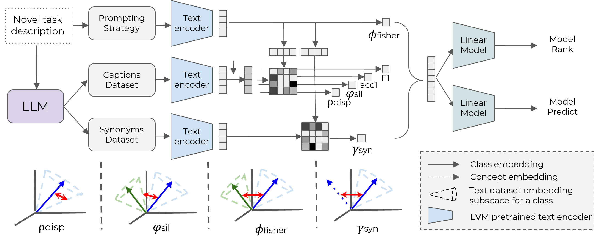
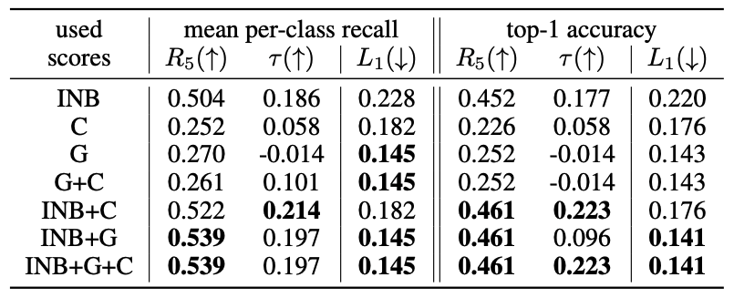

# modelGPT 


## Method



Our baselines (which we call modelGPT) uses a text description of a novel task
and prompts a Large Language Model (LLM) - GPT3.5 to generate the Captions and Synonym Datasets.
We then use every VLM's text encoder to produce both the class weights (top) and the different 
text-based scores (left). On the bottom, you can see a graphical interpretation of each score. 
We then fit linear regression models on these scores to produce our baselines. 


###Requirements
We assume that the following files exist; 

1. LOVM/datasets.txt 
2. LOVM/classnames/{dataset}.txt  
3. LOVM/templates/{dataset}.txt 
4. LOVM/dataset_domains.json
5. LOVM/dataset_tasks.json

All of these contain information that is reasonable a user would provide; specifically, what are the classes, task, and domain of a downstream task, as well as what templates are intended for use. 


### Text Dataset Generation
Here we describe how to generate the text and synonym datasets. 

```
python modelGPT/gen_caption_dataset.py
python modelGPT/gen_syn_dataset.py
```

This will generate json files of the captions and synonym datasets, which you can view. To encode the datasets, run;

```
python modelGPT/encode_dataset.py --text_dir 'modelGPT/captions_dataset' --enc_dir 'modelGPT/encoded_captions_dataset'
python modelGPT/encode_syn_dataset.py --text_dir 'modelGPT/syn_dataset' --enc_dir 'modelGPT/encoded_syn_dataset'
```

This will generate pickle files of the encoded datasets. This makes calcuating the metrics much faster as one does not have to encode the entire dataset each time. 

### Calculating text features
First, you have to create the different VLM models. Rather than continually using open_clip, we opt to just run over all the models once and save pickle files of the proposed zero-shot classification templates. 

```
python modelGPT/create_models.py
```

To generate eval_table_metrics that contains both gt predictions and the text features, run:

```
python modelGPT/calc_text_features.py
```


### Prediction

Using pre-defined features, run modelGPT with the following commends: 
```python
from model_gpt_predictor import ModelGPTPredictor
import pandas as pd

df = pd.read_csv('features.csv')

model_gpt = ModelGPTPredictor(df)


# model ranking
model_rank_pred = model_gpt.loo_model_rank()

# model prediction
model_pred = model_gpt.loo_model_pred()
```


### Evaluation

You can use `generate_results.py`. To evaluate model ranking/performance prediction,
we run:
```bash 
python generate_results.py --model_type linear_regression --pred_type model_rank --pred_target 'acc1'
python generate_results.py --model_type linear_regression --pred_type model_pred --pred_target 'acc1'
python generate_results.py --model_type linear_regression --pred_type model_rank --pred_target 'mean_per_class_recall'
python generate_results.py --model_type linear_regression --pred_type model_pred --pred_target 'mean_per_class_recall'
```

To reproduce the results from our paper, simply run ``eval.sh``

To run on a subset of the scores, like in the main table, use the `--scores` flag:
```bash 
python generate_results.py --model_type linear_regression --pred_type model_rank --scores 'INB'
python generate_results.py --model_type linear_regression --pred_type model_rank --scores 'G,INB'
python generate_results.py --model_type linear_regression --pred_type model_rank --scores 'G,C,INB'
```
or any of their subsets. You can use the `--pred_target` to change the default target (top-1 accuracy) with 
mean per-class recall.

### Ablations

To ablate modelGPT, and generate the ablation tables in the manuscript, we run:
```bash 
python generate_results.py --model_type linear_regression --pred_type model_rank --print_best false
python generate_results.py --model_type linear_regression --pred_type model_pred --print_best false
```

To print the per-dataset breakdown (like in our appendix), set the `--print_full_table true`: 
```bash 
python generate_results.py --model_type linear_regression --pred_type model_rank --scores C,G,INB --ablate_subset true  --print_full_table true 
```


### Additional Ablations:
Do ablation on the model type by removing the --model_type flag
```bash 
python generate_results.py --model_type linear_regression --pred_type model_rank --ablate_subset true
```

Add in hyperparameter search by add in --grid_search flag
```bash 
python generate_results.py --model_type linear_regression --pred_type model_rank --grid_search --ablate_subset true
```


To evaluate specific subset of scores
```bash 
python generate_results.py --model_type linear_regression --pred_type model_rank --subscoreses text-f1,intraclass_sim,inter_close
```


## Results
Our model ranking and performance prediction results for both top-1 accuracy and mean per-class recall are:



